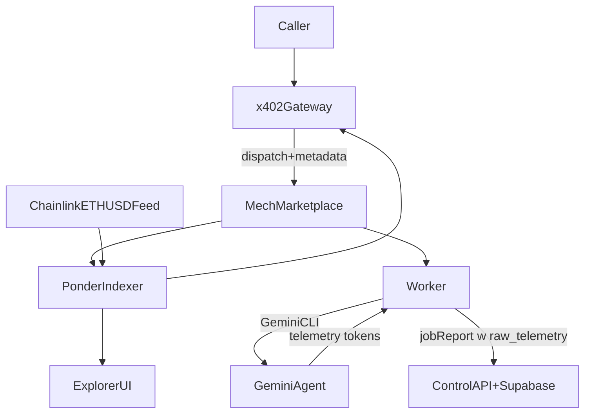

# Template pricing + cost accounting plan

## Assumptions (locked)

- Canonical settlement currency for **x402 is USDC on Base** (CDP facilitator is USDC-only). Store prices as **USDC atomic units (6 decimals)**.
- Mech marketplace on-chain costs (`deliveryRate`, gas) remain **ETH/wei** unless contracts are replaced; treat as operator overhead for hackathon.
- Ponder is the **single source of truth** for template metadata and any price-history we index.
- External callers must be bounded by **hard caps** (tokens/tool calls/time) plus budget checks; “average historical cost” is advisory only.

## Hackathon v0 (simplest safe approach)

Goal: ship a working marketplace listing + execute endpoint with **bounded downside** and **no fragile accounting system**.

- **Template selection**: only expose a small allowlist of templates with meaningful history (e.g. `runCount >= 10` and `successCount/runCount >= 0.8`).
- **Pricing**: set a **static USDC price per template** using top-down historical observation + buffer.
  - Input: historical runs, observed delivery rates, rough compute expectations.
  - Output: `priceUsdc` (6-decimal atomic) stored in template metadata and returned by gateway.
- **Risk controls**:
  - Keep `safetyTier` effectively **public-only** for hackathon (no delegation, no shell/git/write tools).
  - Enforce a strict **callerBudget** check against the template’s fixed price.
  - Add/enable rate limiting separately (not in this plan; payment verification handled in safety workstream).

Non-goals for hackathon:

- indexing Chainlink
- per-run LLM cost accounting
- dynamic per-request pricing

## Current state (what is broken)

- `job_template.priceWei` is treated as **ETH wei** in the gateway formatter, but commented as **USDC 6-decimal atomic units** in the Ponder schema; this makes all pricing/UX incorrect and invalidates any conversion logic.
  - Gateway formats `priceWei` as ETH: [`services/x402-gateway/index.ts`](services/x402-gateway/index.ts)
  - Schema comment claims USDC units: [`ponder/ponder.schema.ts`](ponder/ponder.schema.ts)
- Template “pricing” is currently: recent `delivery.deliveryRate` average + fixed compute margin, not actual LLM usage: [`services/x402-gateway/pricing.ts`](services/x402-gateway/pricing.ts)
- Token usage is already captured by Gemini CLI telemetry parsing (`inputTokens`, `outputTokens`, `totalTokens`) and stored in job reports: [`gemini-agent/agent.ts`](gemini-agent/agent.ts), [`worker/delivery/report.ts`](worker/delivery/report.ts)

## Target architecture

- **Compute accounting** lives in worker (derives cost from telemetry) but aggregates/price-history live in Ponder.
- **Quote** at x402 gateway uses conservative caps + Ponder conversion; **display** uses the same Ponder-derived conversion.

## Work items

### 1) Make currency semantics consistent everywhere

- Canonicalize on **USDC atomic units (6 decimals)** for x402.
- Replace ambiguous `priceWei` naming in template layer with explicit USDC semantics.
- Recommended shape:
  - `priceUsdcMicros` (bigint) canonical for x402
  - `priceUsdText` (string) optional display-only
  - Optional: `priceEthWeiEstimate` if you later want to include ETH-denominated on-chain costs for operator accounting
- Update:
  - Ponder schema (`job_template` table fields and comments): [`ponder/ponder.schema.ts`](ponder/ponder.schema.ts)
  - Template derivation from IPFS metadata (currently reads `content.priceWei`, `content.priceUsd`): [`ponder/src/index.ts`](ponder/src/index.ts)
  - Gateway API response fields and formatting: [`services/x402-gateway/index.ts`](services/x402-gateway/index.ts)
  - Any scripts that pass `priceWei/priceUsd`: `scripts/*template*` (see matches in repo search)

### 2) Index Chainlink ETH/USD into Ponder and compute 30d trailing average

- Post-hackathon track.
- Add Chainlink aggregator contract to Ponder config and an onchain table for price updates.
- Ingest `AnswerUpdated` (or equivalent) events with timestamp/roundId/answer.
- Provide a Ponder query (or a small Ponder-side view) for:
  - latest spot price
  - 30-day trailing average price
- Files:
  - Ponder config: `ponder/ponder.config.ts`
  - Indexer handlers: `ponder/src/index.ts`
  - Schema: `ponder/ponder.schema.ts`

### 3) Implement deterministic run-cost accounting (bottom-up) from telemetry

- Post-hackathon track.
- Define a cost model:
  - `tokensByPhase` (recognition/execution/reflection)
  - `tokensByModel` (if model varies)
  - `usdCost = tokens × modelUnitPriceUsdPer1K` (store pricing table in code/config)
  - Convert USD→ETH using Ponder 30d average
- Emit a structured `costSummary` into:
  - Control API job report `raw_telemetry` (already stored): [`worker/delivery/report.ts`](worker/delivery/report.ts)
  - Delivery payload telemetry (already forwarded to IPFS): [`worker/delivery/payload.ts`](worker/delivery/payload.ts)
- Inputs already available:
  - token counts parsed from CLI telemetry: [`gemini-agent/agent.ts`](gemini-agent/agent.ts)
  - worker phase boundaries: [`worker/orchestration/jobRunner.ts`](worker/orchestration/jobRunner.ts)

### 4) Add enforceable caps (prevents being “rinsed”)

- Hackathon: keep to **public-only toolset** and rely on on-chain 300s timeout + strict tool filtering; add caps only if cheap.
- Post-hackathon: add per-template caps that bound compute:
  - `maxTotalTokens`
  - `maxToolCalls`
  - `maxDurationSeconds`
  - optionally `maxWebFetches` / per-tool quotas
- Enforce at two points:
  - **Gateway**: reject if requested budget < quoted max; include caps in dispatch metadata
  - **Worker**: enforce caps during execution (timeout/kill process; refuse tool calls when quota exceeded)
- Existing enforcement to keep:
  - Safety-tier tool filtering (gateway + worker defense-in-depth):
    - [`services/x402-gateway/security.ts`](services/x402-gateway/security.ts)
    - [`worker/security/toolValidation.ts`](worker/security/toolValidation.ts)
- Clarify/rename tiers if desired, but keep the two-layer enforcement model.

### 5) Replace template pricing algorithm with “quoted max” + “observed actual”

- Hackathon: remove/disable dynamic pricing; use **static USDC template price** only.
- Post-hackathon: replace with “quoted max” + “observed actual”:
  - `quotedMaxUsdcMicros = f(caps, modelUnitCost, trailingAvgEthUsd)` with a buffer
  - aggregate historical `actualCostUsd` / `actualCostUsdcMicros` per template (avg/p50/p95)
  - deprecate current heuristic (deliveryRate average + fixed compute margin): [`services/x402-gateway/pricing.ts`](services/x402-gateway/pricing.ts)

### 6) UI updates for templates

- Show:
  - `priceUsdcMicros` (canonical) and formatted USDC
  - optional `priceUsdText`
  - caps (max tokens/time) and whether delegation is allowed (tier)
- Files:
  - [`frontend/explorer/src/app/templates/page.tsx`](frontend/explorer/src/app/templates/page.tsx)
  - template card components if any

### 7) Backfill aggregates for existing runs

- Use Supabase job reports (`total_tokens`, `raw_telemetry`) to compute per-template historical cost stats.
- Store aggregates in Ponder template fields (`avgCost...`, `runCount`, percentiles) or in Supabase if you want write access; keep Ponder as read layer for the UI.

### 8) Tests + guardrails

- Unit tests:
  - conversion math (USD→ETH, 30d avg)
  - quoting vs caps
  - telemetry → costSummary mapping
- Integration test:
  - gateway execute rejects under-cap budgets
  - worker enforces caps and tool quotas

## Documentation update (operational)

- Record the “currency semantics” rule and safety-tier meaning in [`AGENT_README_TEST.md`](AGENT_README_TEST.md) once implementation lands (avoid repeating this confusion).

## Notes (pricing metadata sources)

- Gemini API `models.get` does **not** return pricing; pricing must be maintained as a config table (or scraped from docs, which is brittle).