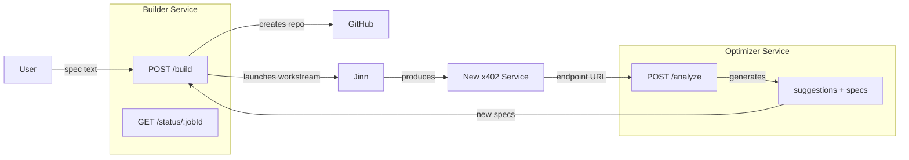

# x402 Builder Service - Bootstrapping x402 Ecosystem

## Architecture



## Phase 1: Builder Service

Create `services/x402-builder/` with Hono + x402-hono.

### Endpoints

| Route | Payment | Purpose |

|-------|---------|---------|

| `POST /build` | $1.00 | Accept spec, create repo, dispatch workstream |

| `GET /status/:jobId` | Free | Query Ponder for workstream status |

| `GET /health` | Free | Railway health check |

### Input Format

```typescript
// POST /build body
interface BuildRequest {
  spec: string;          // Freeform text OR stringified JSON spec
  name?: string;         // Optional repo/service name (auto-generated if missing)
}

// Response
interface BuildResponse {
  jobId: string;         // Workstream request ID
  repoUrl: string;       // GitHub repo URL
  statusUrl: string;     // GET /status/:jobId URL
  explorerUrl: string;   // Jinn Explorer link
}
```

### Implementation

1. **Repo creation**: Use GitHub API with `GITHUB_TOKEN` to create private repo in oaksprout org
2. **Workstream dispatch**: Call `dispatchNewJob` with:

   - Base blueprint for x402 services (embedded in Builder)
   - User spec injected as `additionalContext.userSpec`
   - Repo path set via `CODE_METADATA_REPO_ROOT`

3. **Status**: Query Ponder GraphQL for request status by ID

### Files to Create

- `services/x402-builder/src/index.ts` - Hono app entry
- `services/x402-builder/src/routes/build.ts` - POST /build handler
- `services/x402-builder/src/routes/status.ts` - GET /status handler
- `services/x402-builder/src/lib/github.ts` - Repo creation
- `services/x402-builder/src/lib/dispatch.ts` - Workstream dispatch
- `services/x402-builder/src/lib/base-blueprint.ts` - Embedded blueprint for generated services
- `services/x402-builder/package.json`, `tsconfig.json`, `railway.json`

## Phase 2: Optimizer Enhancement

Extend `blueprints/x402-service-optimizer.json` with assertions for:

1. **IDEATION-001**: After analyzing a service, propose 2-3 new x402 service ideas that would complement it
2. **SPEC-001**: For each idea, produce a structured spec that could be fed to the Builder
3. **AUTO-LOOP-001** (optional): If `autoLoop=true` in request, automatically POST to Builder endpoint

## Key Dependencies

| Dependency | Source | Purpose |

|------------|--------|---------|

| `dispatchNewJob` | `gemini-agent/mcp/tools/dispatch_new_job.ts` | Workstream creation |

| `graphQLRequest` | `http/client.ts` | Ponder status queries |

| `x402-hono` | npm | Payment middleware |

| GitHub API | REST | Repo creation |

## Execution Plan

1. Build `services/x402-builder/` directly (not via Jinn)
2. Test locally: verify repo creation, workstream dispatch, status polling
3. Use Builder to create Optimizer service (dogfooding test)
4. Add ideation/spec assertions to Optimizer