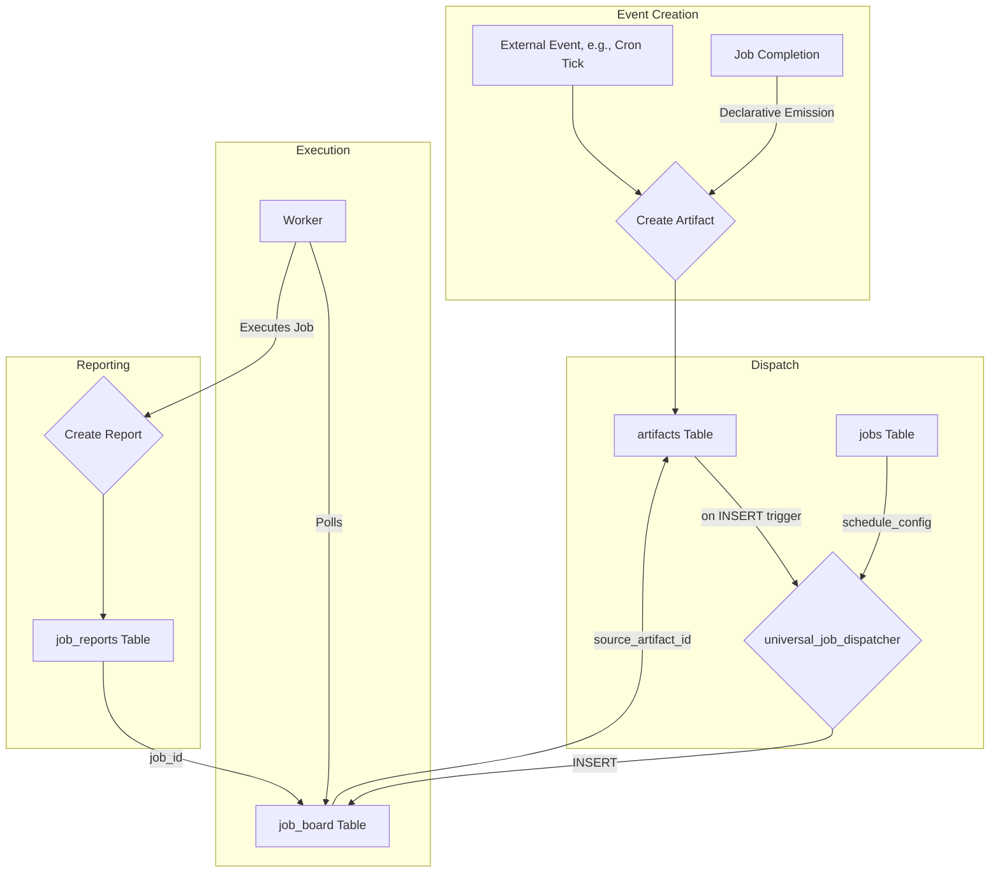

# Database Schema Map

This document provides an overview of the key tables in the Jinn system's PostgreSQL database, with a focus on the components that drive the universal event and job management architecture.

For a completely up-to-date, live view of the schema, use the `get_schema` tool provided by the MCP.

## Core Tables

### `artifacts`
This is the heart of the system's event bus. Every event that can trigger a job—be it from a cron schedule, a job status change, or a declarative emission—is first persisted as a record in this table.

| Column | Type | Description |
| :--- | :--- | :--- |
| `id` | `uuid` | **Primary Key**. Unique identifier for the artifact. |
| `thread_id`| `uuid` | Foreign key linking the artifact to a specific `threads.id`. |
| `topic` | `text` | **Crucial for routing**. The topic of the artifact, used by the dispatcher to match jobs. e.g., `system.job.status_changed`, `analysis_complete`. |
| `content` | `jsonb` | The data payload of the event. Structure depends on the `topic`. |
| `status` | `text` | The processing status of the artifact (e.g., `RAW`, `PROCESSED`). |
| `source_job_id` | `uuid` | Foreign key to `job_board.id`, indicating which job run created this artifact. |
| `source_job_name` | `text` | The name of the job that created this artifact. |
| `created_at` | `timestamptz` | Timestamp of creation. |
| `updated_at`| `timestamptz` | Timestamp of last update. |

### `jobs`
This table contains the master definitions for every job the system can run. It includes the job's logic (prompt), its capabilities (tools), and, most importantly, how it's triggered (`schedule_config`).

| Column | Type | Description |
| :--- | :--- | :--- |
| `id` | `uuid` | **Primary Key**. Unique identifier for a specific version of a job definition. |
| `job_id` | `uuid` | A stable identifier that groups all versions of the same job. |
| `version` | `integer`| The version number of the job definition. |
| `name` | `text` | The unique, human-readable name for the job. |
| `description` | `text` | A brief explanation of the job's purpose. |
| `prompt_content` | `text` | The system prompt that guides the LLM's execution. |
| `enabled_tools` | `text[]` | An array of tool names the job is permitted to use. |
| `schedule_config` | `jsonb` | **Crucial for routing**. Defines how the job is triggered. Always specifies `on_new_artifact` and filters on the artifact `topic`. |
| `emit_artifacts_on` | `jsonb` | Declarative map of job statuses to artifacts to emit. e.g., `{"COMPLETED": [{"topic": "..."}]}`. |
| `is_active` | `boolean` | Whether this job version is currently active and can be dispatched. |

### `job_board`
This table is the runtime queue of jobs to be executed. The `worker` polls this table for `PENDING` jobs. Every record here represents a specific, dispatched instance of a job definition from the `jobs` table.

| Column | Type | Description |
| :--- | :--- | :--- |
| `id` | `uuid` | **Primary Key**. Unique identifier for this specific job run. |
| `job_definition_id` | `uuid`| Foreign key to `jobs.id`, linking to the exact version of the job that was dispatched. |
| `job_name`| `text` | The name of the job being run. |
| **`source_artifact_id`** | `uuid` | **The bedrock of universal tracing**. A non-nullable foreign key to `artifacts.id`. This explicitly links every single job run to the artifact that caused its creation. |
| `status` | `text` | The current status of the job run (`PENDING`, `IN_PROGRESS`, `COMPLETED`, `FAILED`). |
| `worker_id`| `text` | The ID of the worker instance that has claimed this job. |
| `output` | `jsonb` | The final JSON output or result from a completed job. |
| `created_at`| `timestamptz` | Timestamp of when the job was dispatched. |
| `updated_at`| `timestamptz` | Timestamp of last status update. |

### `job_reports`
This table stores the comprehensive results and telemetry for every completed or failed job run. It's the primary source for debugging, analysis, and performance monitoring.

| Column | Type | Description |
| :--- | :--- | :--- |
| `id` | `uuid` | **Primary Key**. |
| `job_id` | `uuid` | Foreign key to `job_board.id` for the job this report belongs to. |
| `duration_ms` | `integer` | Total execution time in milliseconds. |
| `total_tokens`| `integer` | Total tokens used (prompt + completion). |
| `request_text`| `text` | The full text of the request sent to the LLM. |
| `response_text`| `text` | The full text of the response received from the LLM. |
| `error_message`| `text` | Any critical error message if the job failed. |
| `raw_telemetry`| `jsonb` | The complete, detailed telemetry data from the Gemini CLI. |

## Relationships
The core causal flow of the system can be visualized through these relationships:

## Indexes & Constraints

### `job_board.source_artifact_id`
- Constraint: `FOREIGN KEY (source_artifact_id) REFERENCES artifacts(id)`
- Index: `CREATE INDEX IF NOT EXISTS idx_job_board_source_artifact_id ON public.job_board (source_artifact_id);`
- Policy: New jobs created by `universal_job_dispatcher` must have a non-null `source_artifact_id` to guarantee universal causal tracing. Older, backfilled rows may temporarily be null until fully migrated.

### Additional Notes
- The dispatcher only subscribes to `on_new_artifact` events. All other event sources (cron ticks, job status changes, thread events) publish system artifacts rather than calling the dispatcher directly.
- For efficient lineage queries, consider using a lightweight view that joins `job_board` and `artifacts` on `source_artifact_id` (e.g., `v_job_lineage`).
