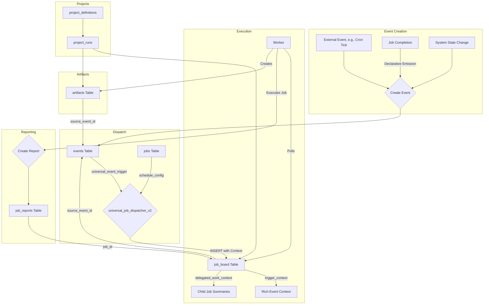

# Database Schema Map

This document provides an overview of the key tables in the Jinn system's PostgreSQL database, with a focus on the components that drive the universal event and job management architecture.

**Database**: intelligence-org (PostgreSQL 17.4.1.043)  
**Last Updated**: January 2025

For a completely up-to-date, live view of the schema, use the `get_schema` tool provided by the MCP.

## Core Tables

### `artifacts`
This table stores artifacts created by job executions, providing data persistence and lineage tracking.

| Column | Type | Description |
| :--- | :--- | :--- |
| `id` | `uuid` | **Primary Key**. Unique identifier for the artifact. |
| `project_run_id` | `uuid` | **Required**. Foreign key linking the artifact to a specific `project_runs.id`. |
| `content` | `text` | The data payload of the artifact. Structure depends on the `topic`. |
| `created_at` | `timestamptz` | Timestamp of creation. |
| `status` | `text` | The processing status of the artifact (e.g., `RAW`, `PROCESSED`). |
| `topic` | `text` | **Crucial for routing**. The topic of the artifact, used by the dispatcher to match jobs. |
| `updated_at` | `timestamptz` | Timestamp of last update. |
| `job_id` | `uuid` | Foreign key to `job_board.id`, indicating which job run created this artifact. |
| `parent_job_definition_id` | `uuid` | Foreign key to `jobs.id`, linking to the job definition that created this artifact. |
| `source_event_id` | `uuid` | Foreign key to `events.id`, linking to the source event. |
| `project_definition_id` | `uuid` | Foreign key to `project_definitions.id`. |

**Indexes**: `idx_artifacts_parent_job_definition_id`, `idx_artifacts_project_definition_id`, `idx_artifacts_source_event_id`

### `events`
The primary event store that drives the entire system. All system activities are captured as events with full lineage tracking.

| Column | Type | Description |
| :--- | :--- | :--- |
| `id` | `uuid` | **Primary Key**. Unique identifier for the event. |
| `event_type` | `text` | **Required**. The type of event (e.g., `artifact.created`, `job.completed`). |
| `payload` | `jsonb` | **Required**. The event data payload. |
| `source_table` | `text` | The table that generated this event. |
| `source_id` | `uuid` | The ID of the record that generated this event. |
| `job_id` | `uuid` | Foreign key to `job_board.id`. |
| `project_run_id` | `uuid` | Foreign key to `project_runs.id`. |
| `parent_event_id` | `uuid` | Self-referential foreign key for event hierarchies. |
| `correlation_id` | `uuid` | **Required**. Groups related events together. |
| `created_at` | `timestamptz` | **Required**. Timestamp of creation. |

**Indexes**: `idx_events_correlation`, `idx_events_created_at`, `idx_events_parent`, `idx_events_type`

### `jobs`
This table contains the master definitions for every job the system can run. It includes the job's logic (prompt), its capabilities (tools), and, most importantly, how it's triggered (`schedule_config`).

| Column | Type | Description |
| :--- | :--- | :--- |
| `id` | `uuid` | **Primary Key**. Unique identifier for a specific version of a job definition. |
| `job_id` | `uuid` | **Required**. A stable identifier that groups all versions of the same job. |
| `version` | `integer` | **Required**. The version number of the job definition. |
| `name` | `text` | **Required**. The unique, human-readable name for the job. |
| `description` | `text` | A brief explanation of the job's purpose. |
| `prompt_content` | `text` | **Required**. The system prompt that guides the LLM's execution. |
| `enabled_tools` | `text[]` | An array of tool names the job is permitted to use. |
| `schedule_config` | `jsonb` | **Required**. Defines how the job is triggered. Always specifies `trigger` and filters. |
| `is_active` | `boolean` | **Required**. Whether this job version is currently active and can be dispatched. |
| `created_at` | `timestamptz` | **Required**. Timestamp of creation. |
| `updated_at` | `timestamptz` | **Required**. Timestamp of last update. |
| `model_settings` | `jsonb` | **Required**. Configuration for the LLM model. |
| `project_definition_id` | `uuid` | Foreign key to `project_definitions.id`. |
| `project_run_id` | `uuid` | Foreign key to `project_runs.id`. |
| `parent_job_definition_id` | `uuid` | Foreign key to `jobs.id` for delegation tracking. Links this job to a parent job that can delegate work to it. |

**Indexes**: `idx_jobs_active_version`, `idx_jobs_created_at`, `idx_jobs_name`, `idx_jobs_project_definition_id`, `idx_jobs_project_run_id`, `idx_jobs_schedule_config_gin`, `idx_jobs_parent_job_definition_id`

**Constraints**: `uq_job_version` (job_id, version)

### `job_board`
This table is the runtime queue of jobs to be executed. The `worker` polls this table for `PENDING` jobs. Every record here represents a specific, dispatched instance of a job definition from the `jobs` table.

| Column | Type | Description |
| :--- | :--- | :--- |
| `id` | `uuid` | **Primary Key**. Unique identifier for this specific job run. |
| `status` | `request_status` | **Required**. The current status of the job run (`PENDING`, `IN_PROGRESS`, `COMPLETED`, `FAILED`). |
| `worker_id` | `text` | The ID of the worker instance that has claimed this job. |
| `created_at` | `timestamptz` | **Required**. Timestamp of when the job was dispatched. |
| `updated_at` | `timestamptz` | **Required**. Timestamp of last status update. |
| `output` | `text` | The final output or result from a completed job. |
| `in_progress_at` | `timestamptz` | When the job started processing. |
| `parent_job_definition_id` | `uuid` | Foreign key to `jobs.id`, linking to the exact version of the job that was dispatched. |
| `enabled_tools` | `text[]` | Array of tools available to this job run. |
| `model_settings` | `jsonb` | Model configuration for this job run. |
| `job_name` | `text` | The name of the job being run. |
| `job_report_id` | `uuid` | Foreign key to `job_reports.id`. |
| **`source_event_id`** | `uuid` | **Required**. **The bedrock of universal tracing**. Foreign key to `events.id`. This explicitly links every single job run to the event that caused its creation. |
| **`project_run_id`** | `uuid` | **Required**. Foreign key to `project_runs.id`. |
| `project_definition_id` | `uuid` | Foreign key to `project_definitions.id`. |
| `project_name` | `text` | The name of the project this job belongs to. |
| `input` | `text` | The input prompt/context for the job. |
| `inbox` | `jsonb` | **Required**. Messages waiting for this job. |
| **`trigger_context`** | `jsonb` | **NEW**. Rich information about what triggered the job, including event details and resolved source data (artifacts, job outputs, etc.). |
| **`delegated_work_context`** | `jsonb` | **NEW**. Comprehensive summaries of work delegated to child jobs, including outputs, artifacts, and job definition IDs for complete traceability. |

**Indexes**: `idx_job_board_parent_job_definition_id`, `idx_job_board_job_report_id`, `idx_job_board_project_definition_id`, `idx_job_board_source_event_id`

### `job_reports`
This table stores the comprehensive results and telemetry for every completed or failed job run. It's the primary source for debugging, analysis, and performance monitoring.

| Column | Type | Description |
| :--- | :--- | :--- |
| `id` | `uuid` | **Primary Key**. |
| `job_id` | `uuid` | Foreign key to `job_board.id` for the job this report belongs to. |
| `worker_id` | `text` | **Required**. The worker that executed the job. |
| `created_at` | `timestamptz` | **Required**. Timestamp of report creation. |
| `status` | `text` | **Required**. The final status (`COMPLETED` or `FAILED`). |
| `duration_ms` | `integer` | **Required**. Total execution time in milliseconds. |
| `total_tokens` | `integer` | Total tokens used (prompt + completion). |
| `request_text` | `jsonb` | The full text of the request sent to the LLM. |
| `response_text` | `jsonb` | The full text of the response received from the LLM. |
| `final_output` | `text` | The final output from the job. |
| `tools_called` | `jsonb` | **Required**. Array of tools called during execution. |
| `error_message` | `text` | Any critical error message if the job failed. |
| `error_type` | `text` | Classification of the error type. |
| `raw_telemetry` | `jsonb` | **Required**. The complete, detailed telemetry data. |
| `parent_job_definition_id` | `uuid` | Foreign key to `jobs.id`. |
| `project_definition_id` | `uuid` | Foreign key to `project_definitions.id`. |
| `source_event_id` | `uuid` | Foreign key to `events.id`. |

**Indexes**: `idx_job_reports_created_at`, `idx_job_reports_duration`, `idx_job_reports_error_type`, `idx_job_reports_parent_job_definition_id`, `idx_job_reports_job_id`, `idx_job_reports_project_definition_id`, `idx_job_reports_source_event_id`, `idx_job_reports_status`, `idx_job_reports_worker_id`

### `memories`
This table stores semantic memories with vector embeddings for intelligent retrieval and context building.

| Column | Type | Description |
| :--- | :--- | :--- |
| `id` | `uuid` | **Primary Key**. |
| `content` | `text` | **Required**. The textual content of the memory. |
| `embedding` | `vector` | **Required**. Vector embedding for semantic search. |
| `created_at` | `timestamptz` | **Required**. When the memory was created. |
| `last_accessed_at` | `timestamptz` | When the memory was last accessed. |
| `metadata` | `jsonb` | Additional metadata for the memory. |
| `linked_memory_id` | `uuid` | Foreign key to `memories.id` for linked memories. |
| `link_type` | `text` | Type of relationship with linked memory. |
| `job_id` | `uuid` | Foreign key to `job_board.id`. |
| `project_run_id` | `uuid` | Foreign key to `project_runs.id`. |
| `parent_job_definition_id` | `uuid` | Foreign key to `jobs.id`. |
| `source_event_id` | `uuid` | Foreign key to `events.id`. |
| `project_definition_id` | `uuid` | Foreign key to `project_definitions.id`. |

**Indexes**: `idx_memories_parent_job_definition_id`, `idx_memories_project_definition_id`, `idx_memories_source_event_id`

### `messages`
This table handles inter-job communication and messaging.

| Column | Type | Description |
| :--- | :--- | :--- |
| `id` | `uuid` | **Primary Key**. |
| `created_at` | `timestamptz` | **Required**. When the message was created. |
| `content` | `text` | **Required**. The message content. |
| `status` | `text` | **Required**. Message status (`PENDING`, `READ`). |
| `job_id` | `uuid` | Foreign key to `job_board.id`. |
| `project_run_id` | `uuid` | Foreign key to `project_runs.id`. |
| `parent_job_definition_id` | `uuid` | Foreign key to `jobs.id`. |
| `source_event_id` | `uuid` | Foreign key to `events.id`. |
| `project_definition_id` | `uuid` | Foreign key to `project_definitions.id`. |
| `to_job_definition_id` | `uuid` | Foreign key to `jobs.id` for the recipient. |

**Indexes**: `idx_messages_parent_job_definition_id`, `idx_messages_project_definition_id`, `idx_messages_source_event_id`

### `project_definitions`
This table stores the master definitions for projects, including objectives, strategies, and KPIs.

| Column | Type | Description |
| :--- | :--- | :--- |
| `id` | `uuid` | **Primary Key**. |
| `name` | `text` | **Required**. Unique project name. |
| `objective` | `text` | Project objective/description. |
| `owner_job_definition_id` | `uuid` | Foreign key to `jobs.id` for the owner. |
| `created_at` | `timestamptz` | **Required**. When the project was defined. |
| `updated_at` | `timestamptz` | **Required**. Last update timestamp. |
| `strategy` | `text` | High-level strategy for the project. |
| `kpis` | `jsonb` | **Required**. Key Performance Indicators. |
| `parent_project_definition_id` | `uuid` | Self-referential foreign key for project hierarchies. |

**Indexes**: `idx_project_definitions_owner_job_definition_id`, `idx_project_definitions_parent`, `uq_project_definitions_name`

### `project_runs`
This table tracks individual executions of projects, linking jobs to project contexts.

| Column | Type | Description |
| :--- | :--- | :--- |
| `id` | `uuid` | **Primary Key**. |
| `status` | `text` | **Required**. Project run status (`OPEN`, `COMPLETED`). |
| `summary` | `jsonb` | Project execution summary. |
| `created_at` | `timestamptz` | **Required**. When the project run started. |
| `updated_at` | `timestamptz` | **Required**. Last update timestamp. |
| `job_id` | `uuid` | Foreign key to `job_board.id`. |
| `project_definition_id` | `uuid` | Foreign key to `project_definitions.id`. |

**Indexes**: `threads_pkey`

### `system_state`
This table stores global system configuration and state information.

| Column | Type | Description |
| :--- | :--- | :--- |
| `key` | `text` | **Primary Key**. Configuration key. |
| `value` | `jsonb` | Configuration value. |
| `updated_at` | `timestamptz` | Last update timestamp. |

### `system_state_history`
This table tracks changes to system state for audit purposes.

| Column | Type | Description |
| :--- | :--- | :--- |
| `id` | `uuid` | **Primary Key**. |
| `state_key` | `text` | **Required**. The state key that changed. |
| `old_value` | `text` | Previous value. |
| `rationale_for_change` | `text` | Reason for the change. |
| `created_at` | `timestamptz` | **Required**. When the change was recorded. |

## Custom Types

### `request_status` (ENUM)
- `PENDING`
- `IN_PROGRESS` 
- `COMPLETED`
- `FAILED`

### `dispatch_trigger_type` (ENUM)
- `on_new_artifact`
- `on_artifact_status_change`
- `on_job_status_change`
- `one-off`
- `on_new_research_thread`
- `on_research_thread_update`
- `on_processing_time_update`

## Views

### `v_job_lineage`
A lightweight view for efficient lineage queries that joins `job_board` and `events` on `source_event_id`.

| Column | Type | Description |
| :--- | :--- | :--- |
| `job_run_id` | `uuid` | Job board ID |
| `parent_job_definition_id` | `uuid` | Job definition ID |
| `job_name` | `text` | Job name |
| `source_event_id` | `uuid` | Source event ID |
| `project_run_id` | `uuid` | Project run ID |
| `job_status` | `text` | Job status |
| `event_type` | `text` | Event type |
| `event_project_run_id` | `uuid` | Event's project run ID |

## Key Functions

### Core Event System
- `emit_event()` - Creates events with full lineage tracking
- `universal_job_dispatcher_v2()` - **UPDATED**. Main trigger function for job dispatch with enhanced context management
- `jsonb_matches_conditions()` - Filters events based on job criteria

### Job Management
- `create_job_from_unified_definition()` - Creates jobs from event triggers
- `plan_project()` - Creates project definitions and job pipelines
- `get_job_impact()` - Analyzes job impact and lineage

### Memory System
- `match_memories()` - Semantic search with vector similarity
- `log_memory_deletion()` - Archives deleted memories

### Utility Functions
- `create_record()`, `read_records()`, `update_records()`, `delete_records()` - CRUD operations
- `trace_lineage_data()` - Traces causal relationships
- `emit_quiescent_if_idle()` - System idle detection

## Triggers

### Event Emission Triggers
Every table has triggers that automatically emit events on INSERT/UPDATE/DELETE:
- `emit_artifact_events()` - Emits artifact lifecycle events
- `emit_job_board_events()` - Emits job status change events  
- `emit_job_report_events()` - Emits job completion events
- `emit_memory_events()` - Emits memory lifecycle events
- `emit_message_events()` - Emits message events
- `emit_project_definition_events()` - Emits project events
- `emit_project_run_events()` - Emits project run events
- `emit_system_state_events()` - Emits system state changes

### Job Dispatch Triggers
- `universal_event_trigger` - **UPDATED**. Main trigger on events table that dispatches jobs using `universal_job_dispatcher_v2`
- `handle_job_board_status_change()` - Handles job status changes
- `handle_system_state_update()` - Handles system state updates

### Utility Triggers
- `touch_artifacts_updated_at()` - Updates timestamps
- `set_in_progress_timestamp()` - Sets job start times
- `populate_job_board_inbox()` - Populates job inboxes
- `link_job_report_automatically()` - Links job reports

## Enhanced Context Management

The system now provides comprehensive operational context through two key mechanisms:

### **Trigger Context (`trigger_context`)**
Rich information about what triggered the job, including:
- **Event Details**: Complete event information (ID, type, payload, source)
- **Resolved Source Data**: Enhanced context from the event's source:
  - **Artifacts**: Full content, topic, status, and metadata
  - **Job Board Entries**: Job execution details, outputs, and related data
  - **Events**: Parent event relationships and correlation IDs
  - **Other Sources**: Table-specific data resolution

### **Delegated Work Context (`delegated_work_context`)**
Comprehensive summaries of work delegated to child jobs, including:
- **Child Job Summaries**: ID, name, output, status, completion time
- **Job Definition IDs**: Complete traceability back to job definitions
- **Artifacts**: Related artifacts created by child jobs (with content truncation)
- **Job Reports**: Performance metrics and final outputs
- **Timing Filtering**: Only work completed after parent's last execution
- **Statistical Overview**: Total counts, completion rates, and timing information

## Relationships
The core causal flow of the system can be visualized through these relationships:

## Indexes & Constraints

### Critical Indexes
- **`job_board.source_event_id`** - Core lineage tracing index
- **`events.event_type`** - Fast event filtering
- **`events.correlation_id`** - Event correlation tracking
- **`jobs.schedule_config_gin`** - GIN index for JSONB schedule matching
- **`memories.embedding`** - Vector similarity search
- **`jobs.parent_job_definition_id`** - **NEW**. Delegation tracking index

### Key Constraints
- **`job_board.source_event_id`** - NOT NULL, ensures universal causal tracing
- **`job_board.project_run_id`** - NOT NULL, ensures project context
- **`uq_job_version`** - Unique constraint on (job_id, version)
- **`uq_project_definitions_name`** - Unique project names

## Extensions
The database uses several key extensions:
- **`vector`** - For memory embeddings and similarity search
- **`pg_cron`** - For scheduled job execution
- **`pg_net`** - For HTTP client functionality
- **`pg_graphql`** - For GraphQL API support

## Additional Notes
- The dispatcher subscribes to `on_new_event` triggers. All event sources publish system events rather than calling the dispatcher directly.
- Every job run is guaranteed to have a `source_event_id` and `project_run_id` for complete lineage tracking.
- The system uses a sophisticated event-driven architecture with automatic job dispatch based on event patterns.
- Vector embeddings enable semantic memory retrieval and context building.
- Project definitions provide hierarchical organization and context for job execution.
- **NEW**: Enhanced context management provides agents with comprehensive operational visibility through trigger context and delegated work context.
- **NEW**: Consistent naming convention uses `parent_job_definition_id` across all tables for clear delegation tracking.
