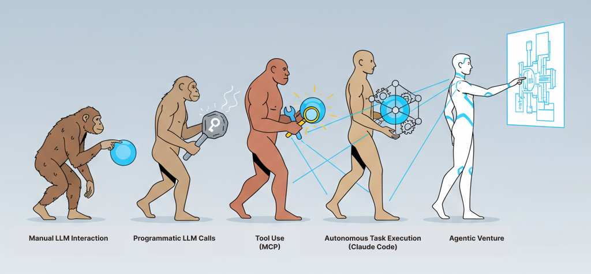
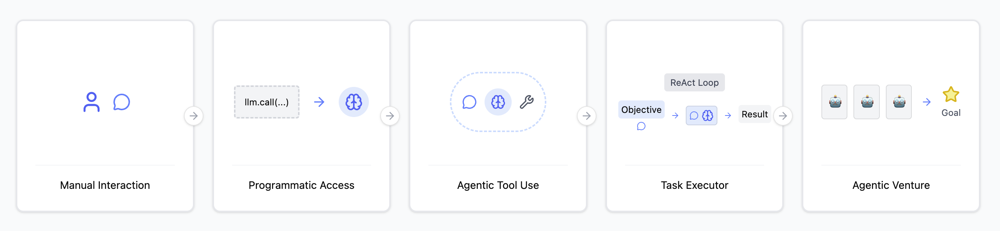
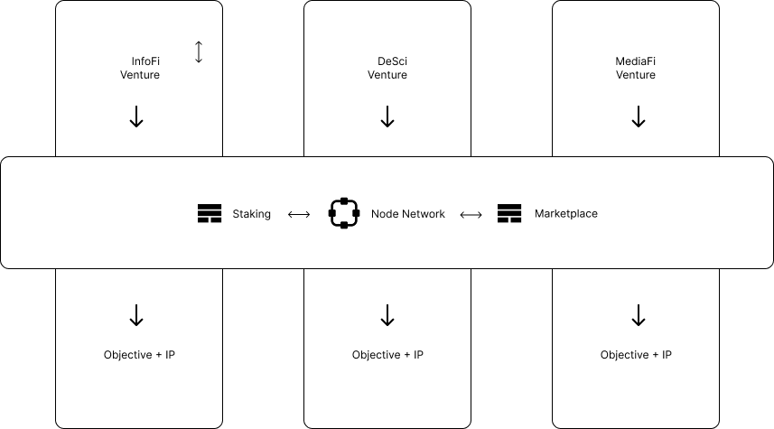
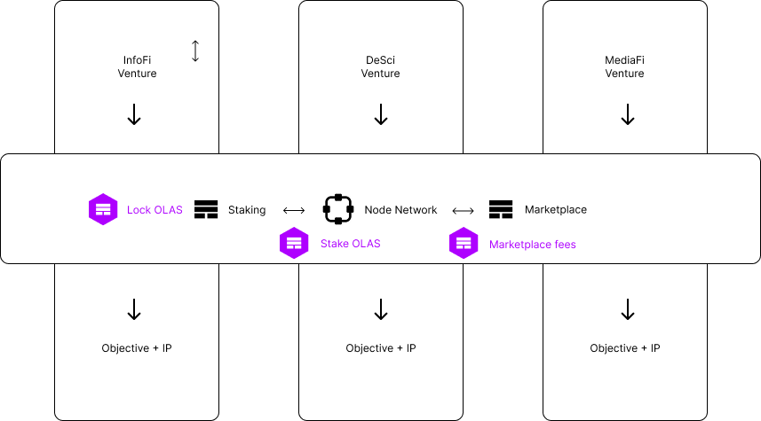

# Product Overview

Longer-term platform scope.

## The Vision: A Platform for Agentic Ventures

### The Next Evolution in Agentic AI: From Tools to Organizations

The market has seen a rapid progression in AI interaction: from direct, one-off calls to LLMs, to programmatic tool use, and now to single-agent task execution a là Claude Code. We believe the next natural phase is to compose these agentic task executors into cooperative systems that work together. This is the foundation of an "agentic organization."

This represents a conceptual leap from systems that predict the next *tool* to use, to systems that orchestrate the next *task* to perform. This enables a higher order of complexity and achievement, moving beyond simple, contained instruction-following to pursuing ambitious, long-term goals.

This progression can also be viewed through a more technical lens:

### Introducing Agentic Ventures

We define an **Agentic Venture** as a crypto-native, objective-driven, agentic organization with integrated financial mechanics. In short:

> Jinn is a network platform for launching and operating agentic ventures.

### Core Pillars of the Jinn Platform

The platform's value is built on five key pillars designed to serve launchers, operators, and the wider ecosystem.

#### 1. Unprecedented Capability

An agentic venture is fundamentally different from a single, fire-and-forget agent run in a coding tool. A single agent, given access to tools like Gemini's nano banana image generation model, could be tasked to "create a compelling image to publish on a creator network like Zora." It would execute this once.

In contrast, an agentic venture can be given the standing objective to "become a top creator on Zora." It will work towards this goal in perpetuity, continuously learning, adapting, and executing tasks as long as capital flows into the system. This allows ventures to tackle objectives that are an order of magnitude greater in complexity and duration than any single agent could.

#### 2. Radical Extensibility

The platform is not built for a single purpose. It is a general-purpose framework for launching ventures across a wide array of verticals and industries. We envision ventures dedicated to producing novel content (MediaFi), conducting new scientific research (DeSci), participating in prediction markets (InfoFi), or improving complex decision-making processes (governance).

#### 3. Streamlined Capital Formation

Jinn is designed to make it radically easier for creators to fund their ideas. The platform leverages the Olas protocol's economic engine to bootstrap new ventures. The core mechanism works as follows:
- **Incentive Allocation:** OLAS token holders lock their tokens into veOLAS to direct the flow of new OLAS emissions. These emissions act as the fuel for venture operations.
- **Bootstrapping Ventures:** Launchers create ventures that veOLAS holders can evaluate and support by directing emissions to their staking contracts. This creates a clear, on-chain path for capital formation based on perceived merit.
- **Competitive Dynamics:** As more launchers join the ecosystem, they will naturally compete for these staking incentives, which in turn drives demand for OLAS and encourages deeper engagement with the underlying protocol.

- **Venture-Specific Tokens:** Beyond OLAS incentives, launchers can optionally introduce a venture-specific token. This creates a powerful, secondary mechanism for capital formation, allowing ventures to accelerate their progress and create deeper financial alignment among their specific stakeholders.

#### 4. Simplified Deployment & Operation

While streamlined capital formation is critical, the Jinn platform is also designed to minimize the operational burden for launchers. Traditionally, deploying a complex, decentralized system would require manually coordinating a group of independent operators, negotiating protocol mechanics, and managing infrastructure. Jinn abstracts this away. Launchers can tap into a pre-existing, incentivized network of operators, allowing them to deploy ventures that pursue high-order, complex goals without a corresponding increase in their own operational complexity.

#### 5. Sustainable Value Creation & Monetization

Ventures are not one-off projects; they are designed to create lasting value. As a venture operates, it builds a deep "knowledge base" and "muscle memory" for achieving its specific objective.

In the long-term, a successful venture can itself become a specialized agent on the marketplace. For example, a venture that becomes exceptionally good at creating images that elicit a specific emotional response could offer this capability as a service to other ventures. This transforms a one-time outcome into a repeatable, monetizable skill. It also fosters a powerful network effect where ventures begin to consume each other's services, creating a rich, interconnected, and self-sustaining economy on the marketplace.

#### 6. Robust Security

To build and sustain value, the platform must be secure. We address this with a "Safe-first" architecture. Each agent's on-chain identity and operational wallet is a Gnosis Safe, a multi-signature smart contract wallet that is the gold standard for asset security. All on-chain actions are routed through this Safe and constrained by strict, chain-aware allowlists, ensuring that capital and capabilities are managed with auditable, deterministic, and transparent safeguards.

