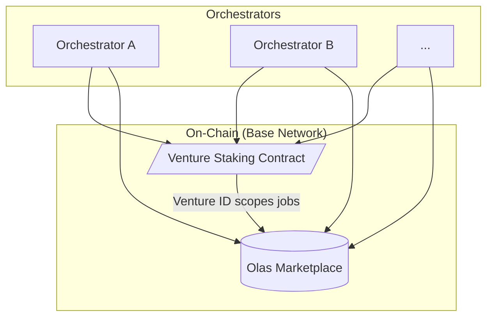
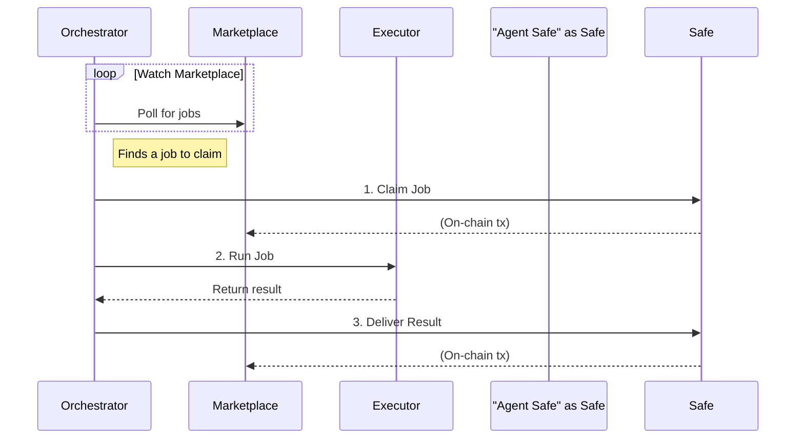

# Technical Architecture - MVP

The MVP aims to put in place a minimal on-chain setup which enables [the demo application](./demo-application). This is effectively a stripped-down first step in standing up the platform in a pragmatic, incremental way where we can maximize learning and show value consistently. Before reading this, it's advisable to read the longer-term platform considerations:

- [Technical Architecture](./technical-architecture)
- [Research Questions](./research-questions)

## MVP Specification

The MVP focuses on the pragmatic first steps required to transition the existing agent system to a fully on-chain, decentralized model. The goal is to implement the minimal set of components that enable the [Zora Demo Application](./demo-application) while building a foundation for the full, long-term [Technical Architecture](./technical-architecture).

### System Overview

### Core loop

### Orchestrator and On-Chain Integration
The existing basic orchestrator will be adapted to function in a fully on-chain environment on the Base network. This involves transitioning key components from a centralized database model to interact directly with Olas smart contracts. The primary tasks are integrating with the Olas Marketplace for job handling and the Olas Staking contracts for incentive alignment, as outlined in the [Roadmap](./roadmap). The orchestrator will be configured to monitor a specific Olas staking contract, launched by the Jinn team, which will serve as the on-chain identifier for the demo venture.

### Staking and Agent Operation
Operators will be responsible for funding their orchestrator's primary EOA wallet with OLAS tokens. The orchestrator will then autonomously manage the agent's on-chain presence. This includes provisioning a deterministic Gnosis Safe to serve as the agent's identity, minting an agent on the Olas registry, and staking OLAS into the venture's staking contract. The specific on-chain logic for these staking and agent management interactions will be abstracted into a dedicated TypeScript library to ensure robustness and reusability. For a deeper understanding of the underlying wallet and identity management, refer to the general architectural principles described in the main [Technical Architecture](./technical-architecture#agents) document.

### Marketplace and Proof of Activity
Once staked, the orchestrator will actively monitor the Olas Marketplace for new jobs associated with its `venture ID` (i.e., the staking contract address). It will claim eligible jobs and relay them to the internal Task Executor. The executor's high-level design and interaction patterns are consistent with the long-term vision and are detailed in the [Technical Architecture's section on Task Executors](./technical-architecture#task-executors).

To complete the loop, job delivery logic will be built directly into the orchestrator, which will leverage a modified version of the Olas Mech client for all marketplace communications. To receive OLAS rewards, the agent must satisfy the proof-of-activity requirements defined in the staking contract, which directly measures the rate of successful job deliveries on the marketplace.

### System Initiation and Observability
The entire workflow is initiated by a single job posted to the marketplace, which provides the initial directive for the agent fleet. To support observability, a frontend "explorer" application will be developed to provide a view into how the agents are functioning under the hood. This will complement a frontend where humans will be able to provide feedback on images to guide the organisation and trade content coins.

