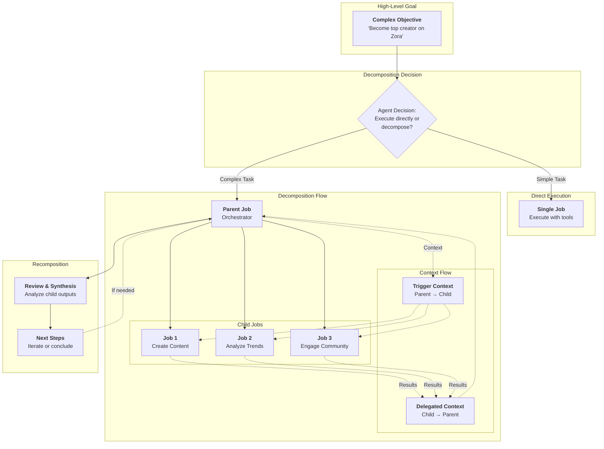
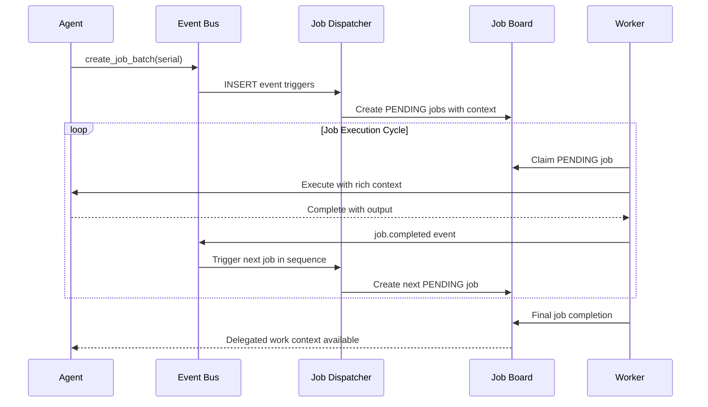
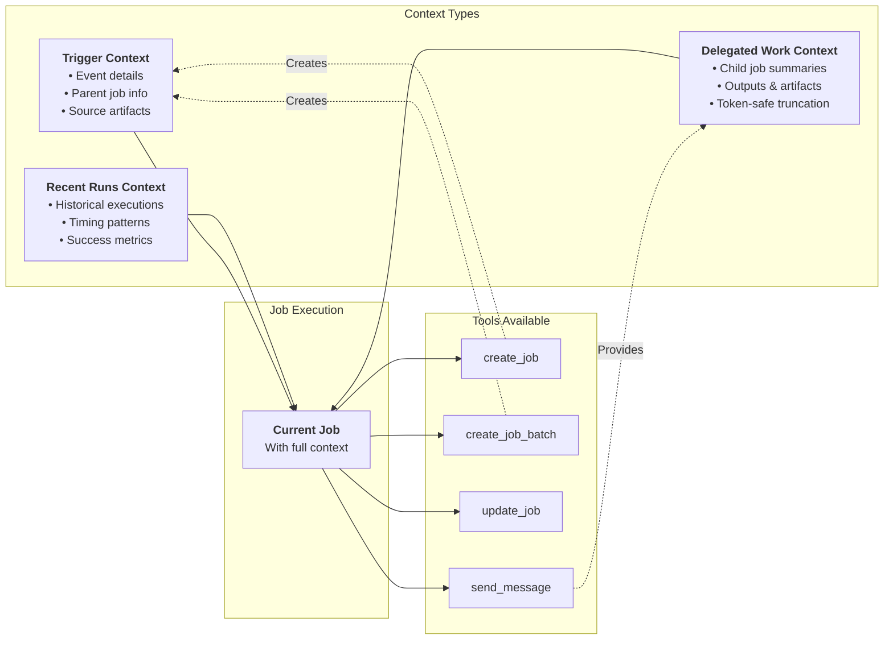
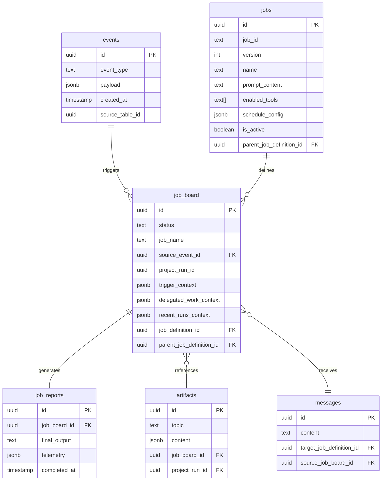
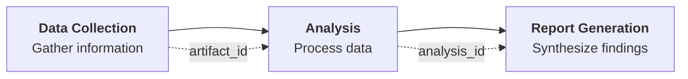
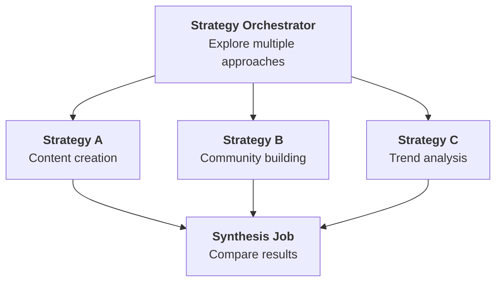
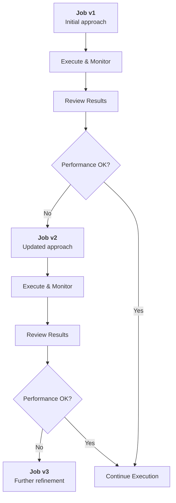

# Work Decomposition Architecture

## System Overview

The work decomposition system enables agents to break complex goals into manageable tasks, execute them with full context continuity, and recompose results. This creates a powerful framework for autonomous task orchestration.

## Event-Driven Orchestration

The system operates through an event-driven architecture where job completion triggers subsequent work:

## Context Construction and Flow

The system maintains rich context across job boundaries:

## Database Architecture

The work decomposition system relies on several key database components:

## Decomposition Patterns

### Serial Pipeline

### Parallel Fan-out

### Iterative Evolution

This architecture enables autonomous agents to tackle complex, long-term objectives by intelligently decomposing work while maintaining full context and traceability throughout the execution process.
