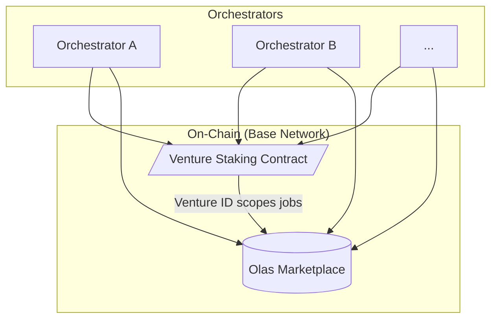

# Jinn

<!--
Welcome everyone. Today we're going to talk about Jinn, the protocol I've been working on since leaving Valory.
-->

---
layout: two-cols
---

# About Us

Jinn was founded by **Oaksprout the Tan** and **Ritsu Kai**, two founding members of Olas DAO.

Our edge is in augmenting cutting-edge LLMs and open-source agent systems with crypto-native technologies like the blockchain and DeFi.

**Our Philosophy:**
-   Stay lean and minimal as a core team.
-   Seek ultra-high autonomy, not just in systems but in our team.
-   Maximally embrace novel AI tooling for exceptional productivity.

<!--
First, a bit about us. We're the founders of Jinn, and our background is in building and investing in crypto-native agentic projects since 2019. We were founding members of Olas DAO and helped lay the foundations for Olas.

Our philosophy is to stay lean and leverage AI tooling to the maximum. This isn't just how we build our product; it's a core principle of the product itself. This connects our team's way of working with the product's vision.
-->

---
layout: default
---

# The Problem
## The Unfulfilled Promise of Agentic AI

Agentic AI systems today, especially in crypto, struggle to deliver complex, meaningful outcomes.

- The reality of their application hasn't met the desires of the market.
- Many "agentic" projects fall flat because their capabilities are limited.

 
This creates a gap between what users want and what current systems can do.

<!--
Let's start with the problem. Agentic AI today has a capability problem. There's a lot of hype, but the actual outcomes are often trivial, especially in crypto. The applications just haven't lived up to the market's desires. This creates a gap between what users want and what current systems can do.
-->

---
layout: default
---

# The Opportunity
## An Evolutionary Leap

We're at an inflection point. The technology is evolving rapidly.

**From:** Manual, one-to-one interactions (chatbots).
**To:** Programmatic calls with tool use.
**Now:** Autonomous task executors (e.g., modern coding agents) that can achieve open-ended goals.

 
The opportunity is to **compose** these powerful new executors into cooperative, end-to-end autonomous systems.

We call these **Agentic Ventures**.

<!--
But we're at an inflection point. The underlying technology has evolved from simple chatbots to powerful, autonomous task executors. The opportunity now is to compose these executors into cooperative systems that can tackle much larger goals. This is what we call an Agentic Venture.
-->

---
layout: cover
background: /assets/evolution-meme.png
---

<!--
This meme illustrates the conceptual leap we're talking about. We're moving from systems that predict the next *tool* to use, to systems that orchestrate the next *task* to perform. 

This shift is crucial because it allows us to move beyond simple, one-off instructions and start pursuing ambitious, long-term goals.
-->

---
layout: cover
background: /assets/evolution-technical-diagram.png
---

<!--
And this isn't just a conceptual shift. It requires a new technical architecture, which you can see here. This is designed from the ground up to support the orchestration and cooperation between agents that our vision requires. We'll touch on the components of this later.
-->

---
layout: default
---

# The Olas Ecosystem Opportunity

The Olas protocol has immense potential, but its true capabilities are yet to be fully unlocked.

**We see two key challenges:**
1.  **High Barrier to Entry:** It's too difficult for developers to build capable agents on Olas.
2.  **Economic Disconnect:** It's hard for those agents to benefit from the protocol's economic infrastructure.

 
Jinn is designed to solve these problems by providing the tools and framework to build, launch, and sustain agents within the Olas ecosystem.

<!--
This brings us to Olas. The Olas protocol has immense potential, but we feel its true capabilities haven't been unlocked. We see two key challenges for developers: it's too hard to build capable agents, and it's too hard for those agents to benefit from the protocol's economic infrastructure. Jinn is designed to solve these problems.
-->

---
layout: statement
---

# Introducing Jinn
## The network for launching agentic ventures.

<!--
This is Jinn: the network for launching agentic ventures.
-->

---
layout: default
---

# What is an Agentic Venture?

We define an **Agentic Venture** as:

> A crypto-native, objective-driven, agentic organization with integrated financial mechanics.

 

Think of it as a fleet of specialized agents, coordinated by on-chain incentives, working together to achieve a long-term goal.

<!--
So, what exactly is an Agentic Venture? We define it as a crypto-native, objective-driven, agentic organization with integrated financial mechanics. A simpler way to think about it is as a fleet of specialized agents, coordinated by on-chain incentives, working together continuously to achieve a long-term goal.
-->

---
layout: two-cols
---

# The Jinn Platform

Jinn provides the framework for launching and operating these ventures, built on five key pillars:

1.  **Unprecedented Capability**
    *   Tackle long-term, complex objectives.
2.  **Radical Extensibility**
    *   A general-purpose framework for any vertical.
3.  **Streamlined Capital Formation**
    *   Leverage Olas to bootstrap and fund ventures.
4.  **Simplified Deployment**
    *   Tap into an existing network of operators.
5.  **Sustainable Value Creation**
    *   Ventures become monetizable skills on the marketplace.

...and **Robust Security** with a Safe-first architecture.

<!--
The Jinn platform provides the framework for launching and operating these ventures. It's built on five key pillars:
1.  **Unprecedented Capability**: This lets us move from asking an agent to 'create an image' to tasking a venture to 'become a top creator on Zora.'
2.  **Radical Extensibility**: It's a general-purpose platform for any vertical, from media and DeSci to prediction markets and governance.
3.  **Streamlined Capital Formation**: We leverage Olas to bootstrap and fund new ventures.
4.  **Simplified Deployment**: Launchers can tap into a pre-existing, incentivized network of operators.
5.  **Sustainable Value Creation**: Ventures can become monetizable, specialized agents on the marketplace themselves.

And all of this is built on a foundation of robust security with a Safe-first architecture.
-->

---
layout: two-cols
---

# Architecture & Principles

::right::

**Guiding Principles:**

- **Decouple logic from execution.**
  *   *What* code does vs. *how* it runs.

- **Humans set ends; agents discover means.**
  *   Humans define goals; agents own execution.

- **Autonomy over scope.**
  *   Prioritize end-to-end autonomy.

- **Respect the flows.**
  *   Build on crypto's fluid economic rails.

<!--
This slide connects our technical architecture to our core philosophy. On the left, you see the key actors: Orchestrators (the workers) and the On-Chain components (the coordination layer). This shows the decentralized nature of the system. On the right are the principles that guide our architecture. For example, we decouple logic from execution so that anyone can build a venture without having to worry about infrastructure.
-->

---
layout: default
---

# The Demo Application
## Making it Real on Zora

To prove and refine the Jinn network, our first venture operates in the **Zora creator economy.**

**Why Zora?**
-   Robust tokenomics
-   Engaged community
-   High potential for agent autonomy

Our agents will use a suite of tools for image generation (Civitai), human feedback, and publishing, all orchestrated by the Jinn network.

<!--
To make this vision concrete, our first venture operates in the Zora creator economy. This is our "dogfooding" effort; we're the first customer of our own platform. Zora is the perfect environment because it's on-chain, economically active, but not as high-stakes as pure DeFi, which is great for testing and learning. Our agents will use a full suite of tools for content creation and publishing.
-->

---
layout: two-cols
---

# Roadmap & Progress

### Completed ✅
-   **Task Executor:** ReAct-style agent with dynamic tool gating.
-   **Transaction Rails:** Deterministic on-chain identity (Safe) and execution.
-   **Research & Validation:** Core concepts proven with a centralized prototype.

 
We've built the foundational modules and validated our core architectural patterns.

::right::

### To Do 🏗️
-   **Olas Marketplace Integration:**
    -   Job watch/claim/deliver loop.
-   **Olas Staking Integration:**
    -   Full on-chain incentive alignment.
-   **Localization:**
    -   Move transaction queue to be local to the Orchestrator.

 
The next phase is about integrating these components into the live, decentralized Olas network.

<!--
This slide shows our momentum and clear path forward. We've already completed significant engineering work on the core executor and transaction rails. The foundational work is done. The next phase, which is our current focus, is about integrating these components into the live, decentralized Olas network.
-->
