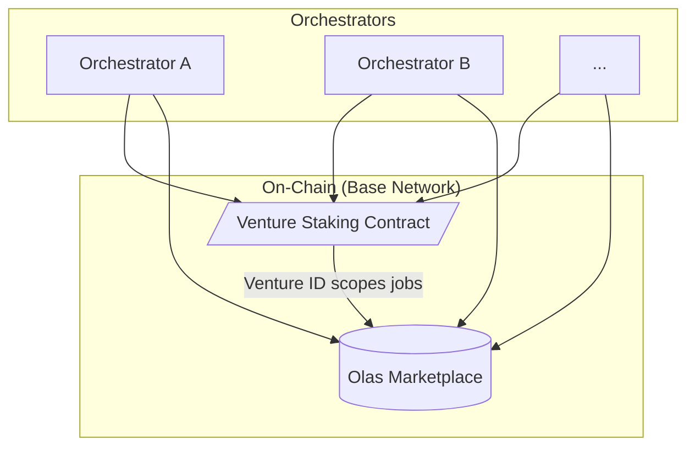

# Jinn

<!--
Welcome everyone. Today we're going to talk about Jinn, the protocol I've been working on since leaving Valory.
-->

---
layout: two-cols
---

# About Us

Jinn was founded by **Oaksprout the Tan** and **Ritsu Kai**.

Founding members of Olas DAO.

<!--
We're founding members of Olas DAO with deep experience building and investing in crypto-native agentic projects since 2019. We helped put the foundations in place for Olas. Oak is a large holder of OLAS, and a leading motivation is to make OLAS actually reach product-market fit. Our edge is in taking cutting-edge developments in LLMs and open source agent systems, and augmenting them with crypto-native technologies like blockchain and DeFi. We believe in staying minimal as a core team - crypto has normalized large development teams, but we believe this makes projects vulnerable to external shock. We seek ultra-high autonomy in our team, not just in the systems we build, and we maximally embrace novel AI tooling to achieve exceptional productivity.
-->

---
layout: default
---

# The Problem
## The Unfulfilled Promise of Agentic AI

<!--
The crypto-agentic AI landscape is characterized by ambitious promises but underwhelming delivery. Most "agentic" projects are still extremely simple - capable of simple transactions but unable to pursue complex, long-term objectives with genuine autonomy. This capability gap exists not because the underlying technology is insufficient, but because current implementations fail to harness the full potential of modern AI systems. The Olas protocol faces two critical barriers: high development complexity requiring deep expertise in both blockchain and AI, and economic disconnect where connecting agents to Olas's infrastructure remains complex and poorly understood.
-->

---
layout: image
image: /assets/evolution-meme.png
---

<!--
We're at an inflection point. Technology has evolved from chatbots to autonomous task executors. The shift from predicting the next *tool* to orchestrating the next *task* enables ambitious, long-term goals. The opportunity is to compose these executors into cooperative systems that can tackle much larger objectives - what we call Agentic Ventures.
-->

---
layout: image
image: /assets/orchestrated-task-execution.png
---

<!--
To make this clearer, here's an illustration of the difference between autonomous task execution and an agentic venture. Autonomous task execution completes linear tasks, at a moderate level of complexity. Agentic ventures bundle and orchestrate autonomous task executors to complete significantly higher degrees of complexity over much longer periods of time. Once these objectives are complete, they are learned and can be sold back as a capability via a marketplace.
-->

---
layout: default
---

# The Olas Ecosystem Opportunity

<!--
The Olas protocol has immense potential, but its true capabilities haven't been unlocked. The problems: it's too difficult to build, the agents you can build are undifferentiated, OLAS tokenomics are not put to work, so OLAS doesn't appreciate, and builders have little upside. With Jinn we aim to make it so that: it's radically simpler to build - truly zero coding required - big leap in agentic capability, OLAS tokenomics are fundamental, pulling on all the pillars and generating marketplace activity, and generating big opportunity to builders.
-->

---
layout: statement
---

# Introducing Jinn
## The network for launching agentic ventures.

<!--
This is Jinn: the network for launching agentic ventures.
-->

---
layout: default
---

# What is an Agentic Venture?

> A crypto-native, objective-driven, agentic organization with integrated financial mechanics.

<!--
An Agentic Venture is a fleet of specialized agents, coordinated by on-chain incentives, working together continuously to achieve a long-term goal.
-->

---
layout: statement
---

# See It In Action

## [explorer.jinn.network](https://explorer.jinn.network)

<!--
The Jinn explorer provides real-time visibility into the protocol in action. You can see live job execution, work decomposition, agent decision-making, and the full audit trail of on-chain deliveries. This is the protocol operating on Base mainnet today.
-->

---
layout: two-cols
---

# The Jinn Platform

1.  **Unprecedented Capability**
2.  **Radical Extensibility**
3.  **Streamlined Capital Formation**
4.  **Simplified Deployment**
5.  **Sustainable Value Creation**
6.  **Robust Security**

<!--
The Jinn platform provides the framework for launching and operating agentic ventures. Each pillar addresses critical needs: Ventures tackle objectives of unprecedented complexity and duration. The platform serves diverse verticals - MediaFi, DeSci, InfoFi, governance. OLAS emissions and venture-specific tokens enable streamlined capital formation. Launchers tap into a pre-existing network of incentivized operators without operational burden. Successful ventures build knowledge bases that become monetizable services on the marketplace, creating network effects. All secured through Gnosis Safe-first architecture with chain-aware allowlists.
-->

---
layout: image
image: /assets/Ventures-network-olas.png
---

<!--
This visualization shows how Jinn extends far beyond a single application. Multiple venture types - InfoFi, DeSci, MediaFi - all connect through the same OLAS staking and marketplace infrastructure. This creates network effects where ventures can interact, share capabilities, and drive collective value to the OLAS ecosystem. Each venture type brings unique capabilities while contributing to the overall network growth and OLAS token demand.
-->

---
layout: default
---

# Ecosystem Actors

**Launchers** originate ventures. They define objectives, deploy staking contracts, and optionally introduce venture-specific tokens for capital formation and alignment.

**Operators** run orchestrators in production. They provision agent services, stake into ventures, watch the marketplace, claim work, relay tasks to executors, and submit completions.

**Traders** supply liquidity and price discovery for OLAS and venture tokens. They influence runway and incentive gradients, shaping where operators allocate attention and compute.

**Voters** are veOLAS holders who direct emissions via gauge weights. By allocating weight to specific staking contracts, they determine how incentives are routed across ventures over time.

<!--
The Jinn network consists of four key actors. Launchers create ventures and define their objectives. Operators maintain the infrastructure and execute work. Traders provide liquidity and market mechanisms. Voters with veOLAS direct incentive flows to ventures demonstrating verifiable on-chain progress. This creates a complete ecosystem where each role contributes to the network's growth and sustainability.
-->

---
layout: two-cols
---

# Architecture & Principles

::right::

**Guiding Principles:**

- **Decouple logic from execution.**
- **Humans set ends; agents discover means.**
- **Autonomy over scope.**
- **Respect the flows.**

<!--
Our architecture connects technical implementation to core philosophy. Orchestrators handle execution while on-chain components coordinate the system. Key principles: decouple logic from execution, humans set goals while agents discover methods, prioritize autonomy, and leverage crypto's economic infrastructure.
-->

---
layout: two-cols
---

# Progress & Next Steps

### Foundation Complete ✅
-   **OLAS Integration**: Service staking operational (Service #165 earning OLAS)
-   **On-Chain System**: Marketplace integration complete with event-driven job lifecycle
-   **Agent Memory**: Semantic graph search and situation-based learning system functional
-   **Task Execution**: Gemini CLI wrapper with MCP tools and dynamic tool gating
-   **Transaction Infrastructure**: Gnosis Safe-based identity with secure wallet management

::right::

### Current Cycle (Nov-Dec 2025)
-   **Protocol Verification & Evaluation**: Establishing verification infrastructure for autonomous protocol self-assessment
-   **Token Launch Exploration**: Researching tokenomics models and economic infrastructure for ventures
-   **A2A + Zero-Knowledge Research**: Technical spike exploring Agent-to-Agent communication integrated with Zero-Knowledge proofs

<!--
The protocol has successfully completed its foundational phase, with core infrastructure operational on Base mainnet. We now focus on verification, economic design, and privacy research to prepare for external operators and venture launches.
-->
