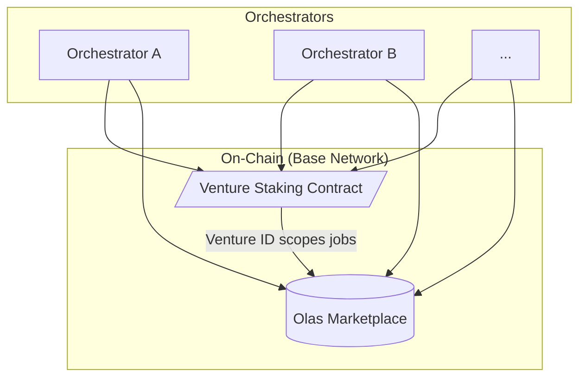

# Jinn

<!--
Welcome everyone. Today we're going to talk about Jinn, the protocol I've been working on since leaving Valory.
-->

---
layout: two-cols
---

# About Us

Jinn was founded by **Oaksprout the Tan** and **Ritsu Kai**.

Founding members of Olas DAO.

<!--
We're the founders of Jinn with deep experience in crypto-native agentic projects since 2019. As founding members of Olas DAO, we specialize in augmenting cutting-edge LLMs with crypto-native technologies. Our philosophy - stay lean, seek ultra-high autonomy, and maximally embrace AI tooling - isn't just how we work; it's a core principle of the product itself.
-->

---
layout: default
---

# The Problem
## The Unfulfilled Promise of Agentic AI

<!--
Agentic AI today has a capability problem. There's significant hype, but actual outcomes are often trivial, especially in crypto. The reality hasn't met market desires - many "agentic" projects fall flat due to limited capabilities, creating a gap between user expectations and system delivery.
-->

---
layout: image
image: /assets/evolution-meme.png
---

<!--
We're at an inflection point. Technology has evolved from chatbots to autonomous task executors. The shift from predicting the next *tool* to orchestrating the next *task* enables ambitious, long-term goals. The opportunity is to compose these executors into cooperative systems that can tackle much larger objectives - what we call Agentic Ventures.
-->

---
layout: default
---

# The Olas Ecosystem Opportunity

<!--
The Olas protocol has immense potential, but its true capabilities haven't been unlocked. We see two key challenges: it's too hard to build capable agents, and it's too hard for builders to benefit from the protocol's economic infrastructure. Jinn solves these problems by providing the tools and framework to launch and sustain agentic applications within the Olas ecosystem, creating clear value flows that benefit OLAS token holders through increased demand and staking activity.
-->

---
layout: statement
---

# Introducing Jinn
## The network for launching agentic ventures.

<!--
This is Jinn: the network for launching agentic ventures.
-->

---
layout: default
---

# What is an Agentic Venture?

> A crypto-native, objective-driven, agentic organization with integrated financial mechanics.

<!--
An Agentic Venture is a fleet of specialized agents, coordinated by on-chain incentives, working together continuously to achieve a long-term goal.
-->

---
layout: two-cols
---

# The Jinn Platform

1.  **Unprecedented Capability**
2.  **Radical Extensibility**
3.  **Streamlined Capital Formation**
4.  **Simplified Deployment**
5.  **Sustainable Value Creation**

...and **Robust Security**.

<!--
The Jinn platform provides the framework for launching and operating these ventures. It's built on five key pillars that address capability, extensibility, capital formation, deployment simplicity, and value creation - all built on robust security with a Safe-first architecture.
-->

---
layout: image
image: ./assets/Ventures-network-olas.png
---

<!--
This visualization shows how Jinn extends far beyond a single application. Multiple venture types - InfoFi, DeSci, MediaFi - all connect through the same OLAS staking and marketplace infrastructure. This creates network effects where ventures can interact, share capabilities, and drive collective value to the OLAS ecosystem. Each venture type brings unique capabilities while contributing to the overall network growth and OLAS token demand.
-->

---
layout: two-cols
---

# Architecture & Principles

::right::

**Guiding Principles:**

- **Decouple logic from execution.**
- **Humans set ends; agents discover means.**
- **Autonomy over scope.**
- **Respect the flows.**

<!--
Our architecture connects technical implementation to core philosophy. Orchestrators handle execution while on-chain components coordinate the system. Key principles: decouple logic from execution, humans set goals while agents discover methods, prioritize autonomy, and leverage crypto's economic infrastructure.
-->

---
layout: default
---

# The Demo Application
## Making it Real on Zora

<!--
Our first venture operates in the Zora creator economy - our "dogfooding" effort as the first customer of our own platform. Zora provides the perfect testing environment: on-chain, economically active, but lower-stakes than DeFi. Our agents use tools for image generation (Civitai), human feedback, and publishing.
-->

---
layout: two-cols
---

# Roadmap & Progress

### Completed ✅
-   **Task Executor**
-   **Transaction Rails**
-   **Research & Validation**

::right::

### To Do 🏗️
-   **Olas Marketplace Integration**
-   **Olas Staking Integration**
-   **Localization**

<!--
We've completed significant foundational work: task executor, transaction rails, and research validation. The next phase focuses on integrating these components into the live, decentralized Olas network through marketplace integration, staking alignment, and orchestrator localization.
-->
